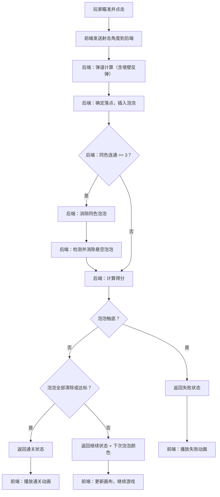

## 1. 产品概述

泡泡射手（Bubble Shooter）是一款经典消除类休闲游戏。玩家发射彩色泡泡，当同色泡泡相连达到指定数量时自动消除，泡泡触底则本局失败。关卡逐步提升泡泡下降速度、增加颜色种类，并设置限定发射次数。

- 目标用户：休闲游戏玩家，碎片化时间娱乐
- 核心价值：简单易上手、策略深度适中、视觉反馈爽快

## 2. 核心功能

### 2.1 功能模块

1. **游戏主页面**：泡泡网格画布、瞄准射击交互、HUD 信息栏、覆盖层弹窗

### 2.2 页面详情

| 页面名称 | 模块名称 | 功能描述 |
|----------|----------|----------|
| 游戏主页面 | 泡泡网格画布 | 六角蜂窝网格，Canvas 渲染泡泡、弹道轨迹、消除动画 |
| 游戏主页面 | 瞄准射击 | 鼠标/触控瞄准，显示辅助线，点击发射泡泡 |
| 游戏主页面 | HUD 信息栏 | 得分、关卡、剩余发射次数、历史最高分 |
| 游戏主页面 | 操作按钮 | 暂停、重玩、切换下一个泡泡颜色 |
| 游戏主页面 | 暂停覆盖层 | 暂停状态展示，继续/重玩按钮 |
| 游戏主页面 | 失败覆盖层 | 泡泡触底失败，显示得分，重玩按钮 |
| 游戏主页面 | 通关覆盖层 | 清空泡泡或达到目标分，显示得分，下一关按钮 |

## 3. 核心流程

玩家进入游戏 → 瞄准并点击发射泡泡 → 后端计算弹道（直线 + 墙壁反弹）与落点 → 后端判定消除（同色连通 >= 3 个则消除）→ 后端检测悬空泡泡并消除 → 后端判定是否触底/通关 → 前端播放动画并更新状态 → 关卡递进或本局结束

## 4. 用户界面设计

### 4.1 设计风格

- 主色调：深色太空背景（#0a0e27），霓虹泡泡色（红/橙/绿/蓝/紫/青）
- 辅助色：金色用于得分和强调（#fbbf24），白色文字
- 按钮风格：圆角胶囊形，半透明毛玻璃质感
- 字体：Orbitron（标题/数字）+ 系统无衬线字体（辅助文字）
- 布局：居中竖向画布，顶部 HUD，底部射击区
- 泡泡风格：渐变 + 高光 + 柔和阴影，消除时粒子爆炸效果

### 4.2 页面设计概览

| 页面名称 | 模块名称 | UI 元素 |
|----------|----------|---------|
| 游戏主页面 | 泡泡网格画布 | 深色背景，六角网格排列彩色泡泡，底部发射区，瞄准辅助线 |
| 游戏主页面 | HUD 信息栏 | 顶部栏：左侧得分/最高分，中间关卡，右侧剩余次数 |
| 游戏主页面 | 操作按钮 | 底部：暂停按钮、重玩按钮、下一泡泡预览 |
| 游戏主页面 | 暂停覆盖层 | 半透明遮罩，居中弹窗："已暂停"，继续/重玩按钮 |
| 游戏主页面 | 失败覆盖层 | 半透明遮罩，居中弹窗："游戏结束"，得分，重玩按钮 |
| 游戏主页面 | 通关覆盖层 | 半透明遮罩，居中弹窗："通关!"，得分，下一关按钮 |

### 4.3 响应式

- 桌面优先，画布固定宽度（400px），居中显示
- 移动端自适应缩放画布，触控操作优化
- HUD 和按钮在小屏幕上紧凑排列

## 5. 关卡设计

| 关卡 | 泡泡颜色数 | 泡泡下降间隔（秒） | 限定发射次数 | 初始行数 |
|------|-----------|-------------------|-------------|---------|
| 1 | 3 | 15 | 无限 | 5 |
| 2 | 3 | 12 | 30 | 6 |
| 3 | 4 | 10 | 28 | 6 |
| 4 | 4 | 8 | 25 | 7 |
| 5+ | 5 | 6 | 22 | 7 |
