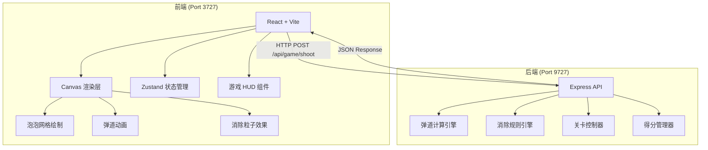
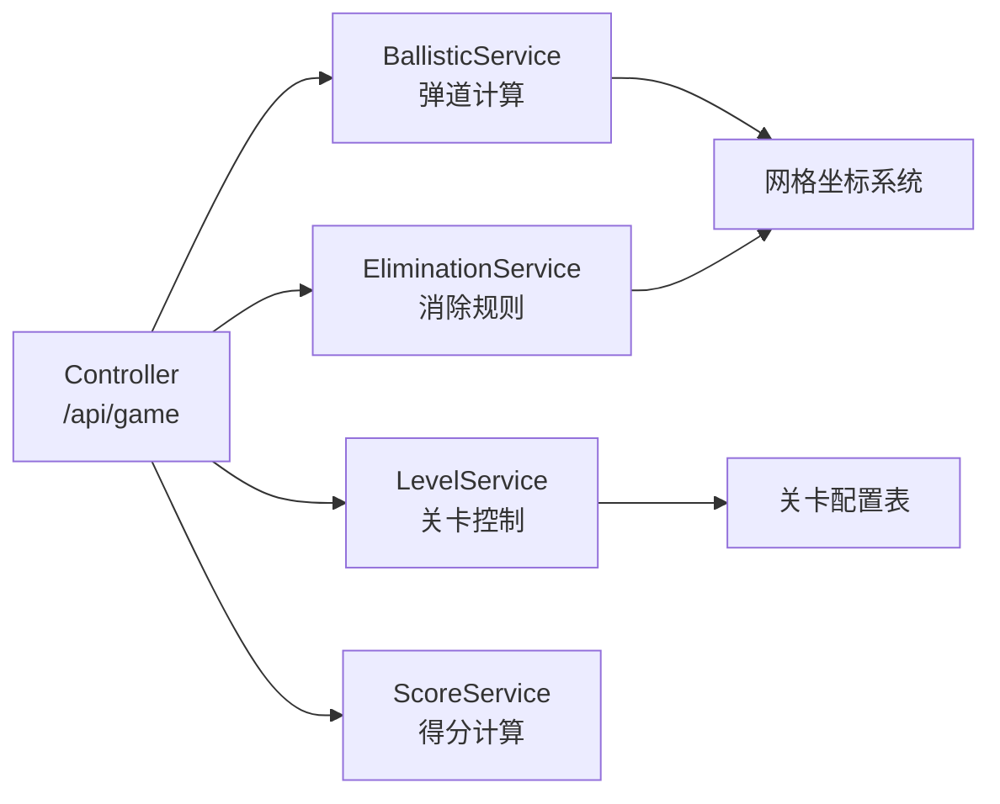

## 1. 架构设计



## 2. 技术说明

- 前端：React@18 + Tailwind CSS@3 + Vite + Zustand
- 后端：Express@4 + TypeScript
- 通信方式：REST API（JSON）
- 无数据库：游戏状态存内存，历史最高分存 localStorage

## 3. 路由定义

| 路由 | 用途 |
|------|------|
| / | 游戏主页面 |

## 4. API 定义

### 4.1 通用类型

```typescript
type BubbleColor = 'red' | 'orange' | 'green' | 'blue' | 'purple' | 'cyan';

interface Position {
  row: number;
  col: number;
}

interface BubbleCell {
  position: Position;
  color: BubbleColor;
}

interface LevelConfig {
  level: number;
  colorCount: number;
  descentInterval: number;
  maxShots: number | null;
  initialRows: number;
  eliminateMin: number;
}
```

### 4.2 POST /api/game/start

请求：
```typescript
{
  level?: number;
}
```

响应：
```typescript
{
  grid: BubbleCell[];
  nextColor: BubbleColor;
  levelConfig: LevelConfig;
  score: number;
  shotsRemaining: number | null;
}
```

### 4.3 POST /api/game/shoot

请求：
```typescript
{
  grid: BubbleCell[];
  angle: number;
  shootColor: BubbleColor;
  levelConfig: LevelConfig;
  shotsRemaining: number | null;
  score: number;
}
```

响应：
```typescript
{
  trajectory: Array<{ x: number; y: number }>;
  landedPosition: Position;
  updatedGrid: BubbleCell[];
  eliminated: BubbleCell[];
  floatingEliminated: BubbleCell[];
  scoreGained: number;
  totalScore: number;
  shotsRemaining: number | null;
  gameOver: boolean;
  levelComplete: boolean;
  nextColor: BubbleColor;
}
```

### 4.4 GET /api/game/levels

响应：
```typescript
{
  levels: LevelConfig[];
}
```

## 5. 服务端架构



## 6. 数据模型

游戏状态为纯内存结构，无持久化数据库。历史最高分通过前端 localStorage 保存。

### 6.1 六角网格坐标系

- 偶数行：col 从 0 到 COLS-1
- 奇数行：col 从 0 到 COLS-2（右移半格偏移）
- 泡泡半径 R，网格宽 = 2R，网格高 = R * √3

### 6.2 弹道计算逻辑

1. 从发射点沿角度方向直线前进
2. 碰到左右边界时 x 方向反弹
3. 碰到已有泡泡或顶部时停止
4. 返回轨迹点序列与最终落点

### 6.3 消除规则

1. 落点泡泡插入网格
2. BFS/DFS 搜索同色连通区域
3. 连通数 >= eliminateMin (3) 则消除
4. 消除后检查悬空泡泡（不与顶部连通的泡泡），一并消除
5. 悬空消除不额外加分（或按半分计算）
